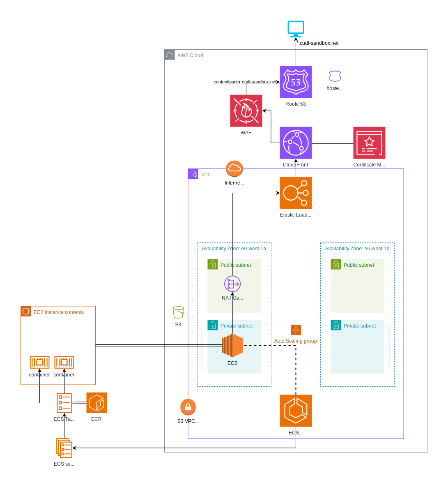

# Terraform Module for ECS Workloads

## Overview

This module builds resources required to support an AWS ECS Service. It is designed to work in conjunction with the module [terraform-aws-architecture-ecs](https://github.com/cambridge-collection/terraform-aws-architecture-ecs). The two modules implement the architecture described below .

A CloudFront distribution allows access to the service via an Application Load Balancer. The ECS Services themselves will run on EC2 instances. Both CloudFront and the Load Balancer will use certificates stored in AWS Certificate Manager.

Note that this module has been designed so that several ECS service can be built on top of the same base architecture (resources built by module `terraform-aws-architecture-ecs`). The input `alb_listener_arn` is key to this arrangement, and a default Load Balancer Listener must have been built externally to allow multiple services to listen on the default HTTPs port 443.

## Private Access and Service Discovery

This module uses an input `allow_private_access` to control whether additional resources for private access will be built. This defaults to false.

When set to true, this module will create an additional Security Group for private access. This is intended to be used by consumers that exist inside the VPC where the ECS Service has been built. This exposed in the output `security_group_private_access_id`. Alongside the security group, a rule will be added to the security group indicated in the input `asg_security_group_id`, allowing access from the private access security group on the port indicated in the input `alb_target_group_port`. An egress rule on the private access security group allows outbound access to the `asg_security_group_id` on the same port.

When `allow_private_access` is set to true this module will also build two AWS Cloud Map resources: a private DNS namespace, and a Service Discovery service. The private DNS namespace will automatically build a managed Route 53 Hosted Zone, and the Service Discovery service will add Route 53 records to the managed hosted zone. This will allow consumers to resolve the private IP(s) of the ECS Service instances.

When the `ecs_network_mode` input is set to "bridge" (the default value) the Route 53 record type will be SRV. This will automatically map to a managed "A" record in the format `<ecs task id>.<ecs service container>.<namespace>`. When `ecs_network_mode` is set to "awsvpc" the Service Discovery Service is able to map the IP address directly and creates an "A" record in the format `<ecs service container>.<namespace>`. In either case the name of the "A" record is exposed in the output `private_access_host`.

## AWS Providers

This module makes use of two providers: one, the default is used to build most resources in the AWS Region of your choice. The other must be configured in the `us-east-1` region, and have an alias `us-east-1`. This  provider is used to build CloudFront resources, along with a AWS Certificate Manager certificate. To configure SSL certificates with CloudFront, the certificate must exist in the `us-east-1` region.

Add this provider to your root module to make use of this module. For example:

```hcl
provider "aws" {
  region = "us-east-1"
  alias  = "us-east-1"

  default_tags {
    tags = var.tags
  }
}
```

This can then be passed to the module, for example:

```hcl
module "my_service" {
  source = "github.com/cambridge-collection/terraform-aws-workload-ecs.git?ref=1.0.0"

  providers = {
    aws.us-east-1 = aws.us-east-1
  }
}
```

## ECS Service IAM Role

An ECS Service can be configured with a custom IAM role. This role allows the ECS Service to interact with the load balancer on your behalf.

If no IAM role is supplied using input `ecs_service_iam_role` the default ECS service-linked role will be used. The role will have an ARN in the format `arn:aws:iam::<account number>:role/aws-service-role/ecs.amazonaws.com/AWSServiceRoleForECS`. This role may not exist in your account, in which case passing the ARN  to the `ecs_service_iam_role` input will cause it to be created. However, AWS will raise an error on apply if the ARN is used and the role already exists.

If using the `awsvpc` networking mode, this module with not allow a custom IAM role to be specified: this is expected behaviour for AWS.

## ECR Repositories

The input `ecr_repositories_exist` can be used to refer to pre-existing ECR Repositories. This defaults to false, meaning this module will create ECR Repositories listed in the input `ecr_repository_names`. Currently, the user will need to make sure images are available in these repositories that match the values specified in the ECS container defintions.

If `ecr_repositories_exist` is set to true the module will lookup the repositories listed in `ecr_repository_names` and no additional ECR resources will be created.

An output `ecr_repository_urls` shows the URIs indicated by the input `ecr_repository_names`. These have the format `<aws account id>.dkr.ecr.<aws region>.amazonaws.com/<repository name>`

### ECS Deployments

Setting the input `ecs_service_capacity_provider_name` allows scaling of the ECS service to be managed by an ECS capacity provider. When this input is unset, the `launch_type` property of the ECS service defaults to "EC2".

An ECS capacity provider can be created in Terraform using a `aws_ecs_capacity_provider` resource, and associated with an ECS cluster using a `aws_ecs_cluster_capacity_providers` resource. The `aws_ecs_capacity_provider` must be connected to an Auto Scaling Group, allowing it to manage capacity in the ASG. When associated with the ECS service using the `ecs_service_capacity_provider_name` input, the capacity provider responds to deployments in the ECS service. When a service is deployed the capacity provider will provision new EC2 instances to meet the estimated requirements of the deployment. To allow this, the Auto Scaling Group must have a maximum capacity size slightly greater than the desired capacity, allowing the desired capacity to increase to accept the new deployment. If the deployment is successful, connections will be drained from the old tasks and unused EC2 instances terminated as the desired capacity is reduced. The deployment lifecycle will be completely managed by a combination of the capacity provider, autoscaling group and ECS service.

See the article https://aws.amazon.com/blogs/containers/deep-dive-on-amazon-ecs-cluster-auto-scaling/ for further details of ECS Cluster Auto Scaling using capacity providers

## EFS Persistence

The module can optionally create an EFS file system, mount targets and access point, as well as a dedicated Security Group for the EFS mount targets. The input `use_efs_persistence` should be set to `true` if this is desired. An EFS mount target is created for each subnet in the input `vpc_subnet_ids`, allowing EFS to be accessed from inside the subnets specified. Note that the list input `vpc_subnet_ids` must have a non-zero length if `use_efs_persistence` is true, as ECS services deployed in a VPC require the mount targets to exist in each subnet used: the mount targets allow the DNS address of the EFS file system to be resolved.

A reference to the EFS file system is created in the ECS Task Definition. If `use_efs_persistence` is set to `true`, a reference is created between the volume and the EFS file system for each item in the input `ecs_task_def_volumes`, effectively mounting the ECS volume on the EFS file system. 

The EFS Access Point is used to modify the permissions on the EFS file system. In testing, this was necessary to enable ECS to mount the file system correctly. The access point defaults to setting the mount to be owned by the root user on the host, with permissions allowing read, write and executable access. Changing the default settings may lead to ECS being unable to modify the permissions on the root directory, or otherwise Docker on the host being able to create files in the file system where the container user is non-root.

Note that services deployed in a VPC that need access to EFS may need a VPC Endpoint for the service `elasticfilesystem` if they don't have a route to the public interface for EFS.

## S3 File Storage

Files can be stored in S3 if needed by ECS. There are two distinct S3 bucket inputs for use by either ECS tasks, or ECS task execution. 

### Task Execution File Storage in S3

The inputs `s3_task_execution_bucket` and `s3_task_execution_additional_buckets` are used to control IAM permissions for task execution requiring access to S3. The input `s3_task_execution_bucket` is the name of the main bucket required by ECS task execution, which can be omitted if no S3 permissions are needed. The input `s3_task_execution_additional_buckets` is a list of additional bucket names that may also be needed for task execution. Objects can be uploaded to the bucket named in the input `s3_task_execution_bucket` using the input `s3_task_execution_bucket_objects`, which is a map of bucket paths and file contents. Note that if the input `s3_task_execution_bucket_objects` is supplied, `s3_task_execution_bucket` must also be defined.

### Task File Storage in S3

The input `s3_task_bucket` is used to control IAM permissions for ECS tasks requring access to S3. Objects can be uploaded to the task bucket using the input `s3_task_bucket_objects`: this is a map of bucket paths and file contents. If the input `s3_task_bucket_objects` is supplied, the input `s3_task_bucket` must also be defined.

### Sensitive Inputs

Both the `s3_task_execution_bucket_objects` and `s3_task_bucket_objects` inputs are set to `sensitive`, meaning the contents of the uploaded files are not displayed in Terraform output.

## DataSync S3 to EFS

The input `datasync_s3_objects_to_efs` can be used to enable AWS DataSync between an S3 bucket and EFS. Note this has no effect if the input `use_efs_persistence` is set to false.

If `datasync_s3_objects_to_efs` and `use_efs_persistence` are both true, DataSync source and target locations will be built. The DataSync source is the S3 bucket named in the input `s3_task_execution_bucket`, the target is the EFS file system created when `use_efs_persistence` is set to `true`. A DataSync task will be created allowing data to be transferred between S3 and EFS. Additionally, security group rules will be created on the security group `aws_security_group.efs` allowing traffic on port 2049 (NFS protocol) to and from the VPC CIDR: this is a requirement for DataSync communication.

Note that if `datasync_s3_objects_to_efs` is set to `true`, the input `s3_task_execution_bucket` must be supplied.

The input `datasync_s3_subdirectory` can be set to sync a specific path in S3. If omitted this will default to the `name_prefix` path: it is assumed that the `s3_task_execution_bucket` will be shared by several services and the `name_prefix` will by default be used to distinguish them.

## ECS Task VPC Networking

When `ecs_network_mode` is set to "awsvpc", AWS assigns the task an private IP address inside the VPC. This allows the task to be assigned its own network configuration. This is configured as a dynamic `network_configuration` block on the `aws_ecs_service.this` resource. Subnets must be specified with the `vpc_subnet_ids` input variable. This input is _not_ required when `ecs_network_mode` is set to "bridge" (the default value). When using the `awsvpc` network mode additional security groups for the task can be specified with the `vpc_security_groups_extra` optional input.

Attempting to use the `network_configuration` block in `aws_ecs_service.this` when `ecs_network_mode` is set to anything other than `awsvpc` lead to an error:

```
InvalidParameterException: Network Configuration is not valid for the given networkMode of this task definition.
```

The inputs `vpc_subnet_ids` and `vpc_security_groups_extra` are ignored if the `ecs_network_mode` value is not "awsvpc".

## Requirements

No requirements.

## Providers

| Name | Version |
|------|---------|
| <a name="provider_aws"></a> [aws](#provider\_aws) | n/a |
| <a name="provider_aws.us-east-1"></a> [aws.us-east-1](#provider\_aws.us-east-1) | n/a |
| <a name="provider_external"></a> [external](#provider\_external) | n/a |

## Modules

No modules.

## Resources

| Name | Type |
|------|------|
| [aws_acm_certificate.this](https://registry.terraform.io/providers/hashicorp/aws/latest/docs/resources/acm_certificate) | resource |
| [aws_acm_certificate.us-east-1](https://registry.terraform.io/providers/hashicorp/aws/latest/docs/resources/acm_certificate) | resource |
| [aws_acm_certificate_validation.this](https://registry.terraform.io/providers/hashicorp/aws/latest/docs/resources/acm_certificate_validation) | resource |
| [aws_appautoscaling_policy.this](https://registry.terraform.io/providers/hashicorp/aws/latest/docs/resources/appautoscaling_policy) | resource |
| [aws_appautoscaling_target.this](https://registry.terraform.io/providers/hashicorp/aws/latest/docs/resources/appautoscaling_target) | resource |
| [aws_autoscaling_attachment.automatic_attachment](https://registry.terraform.io/providers/hashicorp/aws/latest/docs/resources/autoscaling_attachment) | resource |
| [aws_cloudfront_distribution.this](https://registry.terraform.io/providers/hashicorp/aws/latest/docs/resources/cloudfront_distribution) | resource |
| [aws_datasync_location_efs.target](https://registry.terraform.io/providers/hashicorp/aws/latest/docs/resources/datasync_location_efs) | resource |
| [aws_datasync_location_s3.source](https://registry.terraform.io/providers/hashicorp/aws/latest/docs/resources/datasync_location_s3) | resource |
| [aws_datasync_task.s3_to_efs](https://registry.terraform.io/providers/hashicorp/aws/latest/docs/resources/datasync_task) | resource |
| [aws_ecr_repository.new](https://registry.terraform.io/providers/hashicorp/aws/latest/docs/resources/ecr_repository) | resource |
| [aws_ecs_service.this](https://registry.terraform.io/providers/hashicorp/aws/latest/docs/resources/ecs_service) | resource |
| [aws_ecs_task_definition.this](https://registry.terraform.io/providers/hashicorp/aws/latest/docs/resources/ecs_task_definition) | resource |
| [aws_efs_access_point.other](https://registry.terraform.io/providers/hashicorp/aws/latest/docs/resources/efs_access_point) | resource |
| [aws_efs_access_point.this](https://registry.terraform.io/providers/hashicorp/aws/latest/docs/resources/efs_access_point) | resource |
| [aws_efs_file_system.this](https://registry.terraform.io/providers/hashicorp/aws/latest/docs/resources/efs_file_system) | resource |
| [aws_efs_mount_target.this](https://registry.terraform.io/providers/hashicorp/aws/latest/docs/resources/efs_mount_target) | resource |
| [aws_iam_policy.datasync](https://registry.terraform.io/providers/hashicorp/aws/latest/docs/resources/iam_policy) | resource |
| [aws_iam_policy.task_execution_policy](https://registry.terraform.io/providers/hashicorp/aws/latest/docs/resources/iam_policy) | resource |
| [aws_iam_policy.task_policy](https://registry.terraform.io/providers/hashicorp/aws/latest/docs/resources/iam_policy) | resource |
| [aws_iam_role.datasync](https://registry.terraform.io/providers/hashicorp/aws/latest/docs/resources/iam_role) | resource |
| [aws_iam_role.task_execution_role](https://registry.terraform.io/providers/hashicorp/aws/latest/docs/resources/iam_role) | resource |
| [aws_iam_role.task_role](https://registry.terraform.io/providers/hashicorp/aws/latest/docs/resources/iam_role) | resource |
| [aws_iam_role_policy_attachment.datasync](https://registry.terraform.io/providers/hashicorp/aws/latest/docs/resources/iam_role_policy_attachment) | resource |
| [aws_iam_role_policy_attachment.task_additional_policy_attachment](https://registry.terraform.io/providers/hashicorp/aws/latest/docs/resources/iam_role_policy_attachment) | resource |
| [aws_iam_role_policy_attachment.task_execution_policy_attachment](https://registry.terraform.io/providers/hashicorp/aws/latest/docs/resources/iam_role_policy_attachment) | resource |
| [aws_iam_role_policy_attachment.task_policy_attachment](https://registry.terraform.io/providers/hashicorp/aws/latest/docs/resources/iam_role_policy_attachment) | resource |
| [aws_lb_listener_certificate.this](https://registry.terraform.io/providers/hashicorp/aws/latest/docs/resources/lb_listener_certificate) | resource |
| [aws_lb_listener_rule.this](https://registry.terraform.io/providers/hashicorp/aws/latest/docs/resources/lb_listener_rule) | resource |
| [aws_lb_target_group.this](https://registry.terraform.io/providers/hashicorp/aws/latest/docs/resources/lb_target_group) | resource |
| [aws_route53_record.acm_validation_cname](https://registry.terraform.io/providers/hashicorp/aws/latest/docs/resources/route53_record) | resource |
| [aws_route53_record.cloudfront_alias](https://registry.terraform.io/providers/hashicorp/aws/latest/docs/resources/route53_record) | resource |
| [aws_route53_zone_association.cloudmap](https://registry.terraform.io/providers/hashicorp/aws/latest/docs/resources/route53_zone_association) | resource |
| [aws_s3_object.task](https://registry.terraform.io/providers/hashicorp/aws/latest/docs/resources/s3_object) | resource |
| [aws_s3_object.task_execution](https://registry.terraform.io/providers/hashicorp/aws/latest/docs/resources/s3_object) | resource |
| [aws_security_group.efs](https://registry.terraform.io/providers/hashicorp/aws/latest/docs/resources/security_group) | resource |
| [aws_security_group_rule.alb_egress_to_asg](https://registry.terraform.io/providers/hashicorp/aws/latest/docs/resources/security_group_rule) | resource |
| [aws_security_group_rule.asg_egress_nfs_to_efs](https://registry.terraform.io/providers/hashicorp/aws/latest/docs/resources/security_group_rule) | resource |
| [aws_security_group_rule.asg_egress_nfs_to_existing_efs](https://registry.terraform.io/providers/hashicorp/aws/latest/docs/resources/security_group_rule) | resource |
| [aws_security_group_rule.asg_ingress_from_alb](https://registry.terraform.io/providers/hashicorp/aws/latest/docs/resources/security_group_rule) | resource |
| [aws_security_group_rule.efs_egress_nfs_to_vpc](https://registry.terraform.io/providers/hashicorp/aws/latest/docs/resources/security_group_rule) | resource |
| [aws_security_group_rule.efs_ingress_nfs_from_asg](https://registry.terraform.io/providers/hashicorp/aws/latest/docs/resources/security_group_rule) | resource |
| [aws_security_group_rule.efs_ingress_nfs_from_vpc](https://registry.terraform.io/providers/hashicorp/aws/latest/docs/resources/security_group_rule) | resource |
| [aws_security_group_rule.private_access_egress](https://registry.terraform.io/providers/hashicorp/aws/latest/docs/resources/security_group_rule) | resource |
| [aws_service_discovery_private_dns_namespace.this](https://registry.terraform.io/providers/hashicorp/aws/latest/docs/resources/service_discovery_private_dns_namespace) | resource |
| [aws_service_discovery_service.this](https://registry.terraform.io/providers/hashicorp/aws/latest/docs/resources/service_discovery_service) | resource |
| [aws_cloudfront_cache_policy.managed_caching_disabled](https://registry.terraform.io/providers/hashicorp/aws/latest/docs/data-sources/cloudfront_cache_policy) | data source |
| [aws_cloudfront_origin_request_policy.managed_all_viewer](https://registry.terraform.io/providers/hashicorp/aws/latest/docs/data-sources/cloudfront_origin_request_policy) | data source |
| [aws_ecr_repository.existing](https://registry.terraform.io/providers/hashicorp/aws/latest/docs/data-sources/ecr_repository) | data source |
| [aws_efs_file_system.other](https://registry.terraform.io/providers/hashicorp/aws/latest/docs/data-sources/efs_file_system) | data source |
| [aws_iam_policy_document.datasync_assume_role](https://registry.terraform.io/providers/hashicorp/aws/latest/docs/data-sources/iam_policy_document) | data source |
| [aws_iam_policy_document.datasync_permissions](https://registry.terraform.io/providers/hashicorp/aws/latest/docs/data-sources/iam_policy_document) | data source |
| [aws_iam_policy_document.ecs_assume_role](https://registry.terraform.io/providers/hashicorp/aws/latest/docs/data-sources/iam_policy_document) | data source |
| [aws_iam_policy_document.task_execution_role_permissions](https://registry.terraform.io/providers/hashicorp/aws/latest/docs/data-sources/iam_policy_document) | data source |
| [aws_iam_policy_document.task_role_permissions](https://registry.terraform.io/providers/hashicorp/aws/latest/docs/data-sources/iam_policy_document) | data source |
| [aws_region.this](https://registry.terraform.io/providers/hashicorp/aws/latest/docs/data-sources/region) | data source |
| [aws_route53_zone.domain](https://registry.terraform.io/providers/hashicorp/aws/latest/docs/data-sources/route53_zone) | data source |
| [aws_s3_bucket.datasync](https://registry.terraform.io/providers/hashicorp/aws/latest/docs/data-sources/s3_bucket) | data source |
| [aws_subnet.ecs](https://registry.terraform.io/providers/hashicorp/aws/latest/docs/data-sources/subnet) | data source |
| [aws_vpc.this](https://registry.terraform.io/providers/hashicorp/aws/latest/docs/data-sources/vpc) | data source |
| [external_external.route53_a_record](https://registry.terraform.io/providers/hashicorp/external/latest/docs/data-sources/external) | data source |

## Inputs

| Name | Description | Type | Default | Required |
|------|-------------|------|---------|:--------:|
| <a name="input_account_id"></a> [account\_id](#input\_account\_id) | AWS Account ID used to interpolate ECS Service IAM role ARN | `string` | n/a | yes |
| <a name="input_acm_certificate_arn"></a> [acm\_certificate\_arn](#input\_acm\_certificate\_arn) | ARN of an existing certificate in Amazon Certificate Manager | `string` | `null` | no |
| <a name="input_acm_certificate_arn_us-east-1"></a> [acm\_certificate\_arn\_us-east-1](#input\_acm\_certificate\_arn\_us-east-1) | ARN of an existing certificate in us-east-1 AWS Region of Amazon Certificate Manager. For use by CloudFront Distribution | `string` | `null` | no |
| <a name="input_acm_certificate_validation_timeout"></a> [acm\_certificate\_validation\_timeout](#input\_acm\_certificate\_validation\_timeout) | Length of time to wait for the public ACM certificate to validate | `string` | `"10m"` | no |
| <a name="input_acm_create_certificate"></a> [acm\_create\_certificate](#input\_acm\_create\_certificate) | Whether to create a certificate in Amazon Certificate Manager | `bool` | `true` | no |
| <a name="input_alb_arn"></a> [alb\_arn](#input\_alb\_arn) | ARN of the ALB used by the listener | `string` | n/a | yes |
| <a name="input_alb_dns_name"></a> [alb\_dns\_name](#input\_alb\_dns\_name) | DNS name for the ALB used by the Cloudfront distribution | `string` | n/a | yes |
| <a name="input_alb_listener_arn"></a> [alb\_listener\_arn](#input\_alb\_listener\_arn) | The Application Load Balancer Listener ARN to add the forward rule and certificate to | `string` | n/a | yes |
| <a name="input_alb_listener_rule_create"></a> [alb\_listener\_rule\_create](#input\_alb\_listener\_rule\_create) | Whether to create a Load Balancer Listener Rule | `bool` | `true` | no |
| <a name="input_alb_listener_rule_priority"></a> [alb\_listener\_rule\_priority](#input\_alb\_listener\_rule\_priority) | The priority for the rule between 1 and 50000.<br>Leaving it unset will automatically set the rule with next available priority<br>after currently existing highest rule. A listener can't have multiple rules<br>with the same priority. | `string` | `null` | no |
| <a name="input_alb_security_group_id"></a> [alb\_security\_group\_id](#input\_alb\_security\_group\_id) | ID of the ALB Security Group for creating ingress to the ALB | `string` | n/a | yes |
| <a name="input_alb_target_group_deregistration_delay"></a> [alb\_target\_group\_deregistration\_delay](#input\_alb\_target\_group\_deregistration\_delay) | Amount time for ELB to wait before changing the state of a deregistering target from draining to unused | `number` | `300` | no |
| <a name="input_alb_target_group_health_check_healthy_threshold"></a> [alb\_target\_group\_health\_check\_healthy\_threshold](#input\_alb\_target\_group\_health\_check\_healthy\_threshold) | The number of checks before a target is registered as Healthy | `number` | `2` | no |
| <a name="input_alb_target_group_health_check_interval"></a> [alb\_target\_group\_health\_check\_interval](#input\_alb\_target\_group\_health\_check\_interval) | Time in seconds between health checks | `number` | `60` | no |
| <a name="input_alb_target_group_health_check_path"></a> [alb\_target\_group\_health\_check\_path](#input\_alb\_target\_group\_health\_check\_path) | Path for health checks on the service | `string` | `"/"` | no |
| <a name="input_alb_target_group_health_check_status_code"></a> [alb\_target\_group\_health\_check\_status\_code](#input\_alb\_target\_group\_health\_check\_status\_code) | HTTP Status Code to use in target group health check | `string` | `"200"` | no |
| <a name="input_alb_target_group_health_check_timeout"></a> [alb\_target\_group\_health\_check\_timeout](#input\_alb\_target\_group\_health\_check\_timeout) | Time in seconds after which no response from a target means a failed health check | `number` | `10` | no |
| <a name="input_alb_target_group_health_check_unhealthy_threshold"></a> [alb\_target\_group\_health\_check\_unhealthy\_threshold](#input\_alb\_target\_group\_health\_check\_unhealthy\_threshold) | The number of checks before a target is registered as Unhealthy | `number` | `5` | no |
| <a name="input_alb_target_group_port"></a> [alb\_target\_group\_port](#input\_alb\_target\_group\_port) | Port number to use for the target group | `number` | n/a | yes |
| <a name="input_alb_target_group_protocol"></a> [alb\_target\_group\_protocol](#input\_alb\_target\_group\_protocol) | Protocol to use for the target group | `string` | `"HTTP"` | no |
| <a name="input_alb_target_group_slow_start"></a> [alb\_target\_group\_slow\_start](#input\_alb\_target\_group\_slow\_start) | Amount time for targets to warm up before the load balancer sends them a full share of requests | `number` | `0` | no |
| <a name="input_allow_private_access"></a> [allow\_private\_access](#input\_allow\_private\_access) | Whether to allow private access to the service | `bool` | `false` | no |
| <a name="input_alternative_domain_names"></a> [alternative\_domain\_names](#input\_alternative\_domain\_names) | List of additional domain names to add to ALB listener rule and CloudFront distribution | `list(string)` | `[]` | no |
| <a name="input_asg_name"></a> [asg\_name](#input\_asg\_name) | Name of Autoscaling Group for registering with ALB Target Group | `string` | n/a | yes |
| <a name="input_asg_security_group_id"></a> [asg\_security\_group\_id](#input\_asg\_security\_group\_id) | ID of the ASG Security Group for creating ingress from from ALB | `string` | n/a | yes |
| <a name="input_cloudfront_access_logging"></a> [cloudfront\_access\_logging](#input\_cloudfront\_access\_logging) | Whether to log CloudFront requests | `bool` | `false` | no |
| <a name="input_cloudfront_access_logging_bucket"></a> [cloudfront\_access\_logging\_bucket](#input\_cloudfront\_access\_logging\_bucket) | S3 bucket name for CloudFront access logs | `string` | `null` | no |
| <a name="input_cloudfront_allowed_methods"></a> [cloudfront\_allowed\_methods](#input\_cloudfront\_allowed\_methods) | List of methods allowed by the CloudFront Distribution | `list(string)` | <pre>[<br>  "HEAD",<br>  "GET",<br>  "OPTIONS"<br>]</pre> | no |
| <a name="input_cloudfront_cached_methods"></a> [cloudfront\_cached\_methods](#input\_cloudfront\_cached\_methods) | List of methods cached by the CloudFront Distribution | `list(string)` | <pre>[<br>  "HEAD",<br>  "GET"<br>]</pre> | no |
| <a name="input_cloudfront_origin_connection_attempts"></a> [cloudfront\_origin\_connection\_attempts](#input\_cloudfront\_origin\_connection\_attempts) | Number of times that CloudFront attempts to connect to the origin. Must be between 1-3 | `number` | `3` | no |
| <a name="input_cloudfront_origin_read_timeout"></a> [cloudfront\_origin\_read\_timeout](#input\_cloudfront\_origin\_read\_timeout) | Read timeout for CloudFront origin | `number` | `60` | no |
| <a name="input_cloudfront_viewer_request_function_arn"></a> [cloudfront\_viewer\_request\_function\_arn](#input\_cloudfront\_viewer\_request\_function\_arn) | ARN of a CloudFront Function to add to CloudFront Distribution in Request | `string` | `null` | no |
| <a name="input_cloudfront_viewer_response_function_arn"></a> [cloudfront\_viewer\_response\_function\_arn](#input\_cloudfront\_viewer\_response\_function\_arn) | ARN of a CloudFront Function to add to CloudFront Distribution in Response | `string` | `null` | no |
| <a name="input_cloudfront_waf_acl_arn"></a> [cloudfront\_waf\_acl\_arn](#input\_cloudfront\_waf\_acl\_arn) | ARN of the WAF Web ACL for use by CloudFront | `string` | n/a | yes |
| <a name="input_cloudmap_associate_vpc_ids"></a> [cloudmap\_associate\_vpc\_ids](#input\_cloudmap\_associate\_vpc\_ids) | List of VPC IDs to associate with Cloud Map Service Discovery | `list(string)` | `[]` | no |
| <a name="input_cloudwatch_log_group_arn"></a> [cloudwatch\_log\_group\_arn](#input\_cloudwatch\_log\_group\_arn) | ARN of the CloudWatch Log Group for adding to IAM task execution role policy | `string` | n/a | yes |
| <a name="input_datasync_bytes_per_second"></a> [datasync\_bytes\_per\_second](#input\_datasync\_bytes\_per\_second) | Limits the bandwidth used by a DataSync task | `number` | `-1` | no |
| <a name="input_datasync_overwrite_mode"></a> [datasync\_overwrite\_mode](#input\_datasync\_overwrite\_mode) | Specifies whether DataSync should modify or preserve data at the destination location | `string` | `"ALWAYS"` | no |
| <a name="input_datasync_preserve_deleted_files"></a> [datasync\_preserve\_deleted\_files](#input\_datasync\_preserve\_deleted\_files) | Specifies whether files in the destination location that don't exist in the source should be preserved | `string` | `"PRESERVE"` | no |
| <a name="input_datasync_s3_objects_to_efs"></a> [datasync\_s3\_objects\_to\_efs](#input\_datasync\_s3\_objects\_to\_efs) | Whether to use DataSync to replicate S3 objects to EFS file system | `bool` | `false` | no |
| <a name="input_datasync_s3_source_bucket_name"></a> [datasync\_s3\_source\_bucket\_name](#input\_datasync\_s3\_source\_bucket\_name) | Name of an S3 bucket to use as DataSync source | `string` | `null` | no |
| <a name="input_datasync_s3_subdirectory"></a> [datasync\_s3\_subdirectory](#input\_datasync\_s3\_subdirectory) | Allows a custom S3 subdirectory for DataSync source to be specified | `string` | `"/"` | no |
| <a name="input_datasync_s3_to_efs_pattern"></a> [datasync\_s3\_to\_efs\_pattern](#input\_datasync\_s3\_to\_efs\_pattern) | Pattern to filter DataSync transfer task from S3 to EFS | `string` | `null` | no |
| <a name="input_datasync_transfer_mode"></a> [datasync\_transfer\_mode](#input\_datasync\_transfer\_mode) | The default states DataSync copies only data or metadata that is new or different content from the source location to the destination location | `string` | `"CHANGED"` | no |
| <a name="input_domain_name"></a> [domain\_name](#input\_domain\_name) | Domain Name to be used for the ACM certificate and Route 53 record | `string` | n/a | yes |
| <a name="input_ecr_repositories_exist"></a> [ecr\_repositories\_exist](#input\_ecr\_repositories\_exist) | Whether the ECR repositories in ecr\_repository\_names already exist | `bool` | `false` | no |
| <a name="input_ecr_repository_force_delete"></a> [ecr\_repository\_force\_delete](#input\_ecr\_repository\_force\_delete) | Whether to delete non-empty ECR repositories | `bool` | `false` | no |
| <a name="input_ecr_repository_names"></a> [ecr\_repository\_names](#input\_ecr\_repository\_names) | List of names of ECR repositories required by this workload | `list(string)` | `[]` | no |
| <a name="input_ecs_cluster_arn"></a> [ecs\_cluster\_arn](#input\_ecs\_cluster\_arn) | ARN of the ECS cluster to which this workload should be deployed | `string` | n/a | yes |
| <a name="input_ecs_network_mode"></a> [ecs\_network\_mode](#input\_ecs\_network\_mode) | Networking mode specified in the ECS Task Definition. One of host, bridge, awsvpc | `string` | `"bridge"` | no |
| <a name="input_ecs_service_capacity_provider_name"></a> [ecs\_service\_capacity\_provider\_name](#input\_ecs\_service\_capacity\_provider\_name) | Name of a ECS Capacity Provider to use with the ECS Service, other than the default | `string` | `null` | no |
| <a name="input_ecs_service_capacity_provider_strategy_base"></a> [ecs\_service\_capacity\_provider\_strategy\_base](#input\_ecs\_service\_capacity\_provider\_strategy\_base) | Minimum number of tasks to run on the specified ECS Capacity Provider | `number` | `1` | no |
| <a name="input_ecs_service_capacity_provider_strategy_weight"></a> [ecs\_service\_capacity\_provider\_strategy\_weight](#input\_ecs\_service\_capacity\_provider\_strategy\_weight) | Percentage of tasks to run on the specified ECS Capacity Provider | `number` | `100` | no |
| <a name="input_ecs_service_container_name"></a> [ecs\_service\_container\_name](#input\_ecs\_service\_container\_name) | Name of container to associated with the load balancer configuration in the ECS service | `string` | n/a | yes |
| <a name="input_ecs_service_container_port"></a> [ecs\_service\_container\_port](#input\_ecs\_service\_container\_port) | Container port number associated load balancer configuration in the ECS service. This must match a container port in the container definition port mappings | `number` | n/a | yes |
| <a name="input_ecs_service_deployment_maximum_percent"></a> [ecs\_service\_deployment\_maximum\_percent](#input\_ecs\_service\_deployment\_maximum\_percent) | Maximum percentage of tasks to allowed to run during a deployment (percentage of desired count) | `number` | `200` | no |
| <a name="input_ecs_service_deployment_minimum_healthy_percent"></a> [ecs\_service\_deployment\_minimum\_healthy\_percent](#input\_ecs\_service\_deployment\_minimum\_healthy\_percent) | Minimum percentage of tasks to keep running during a deployment (percentage of desired count) | `number` | `100` | no |
| <a name="input_ecs_service_desired_count"></a> [ecs\_service\_desired\_count](#input\_ecs\_service\_desired\_count) | Sets the Desired Count for the ECS Service | `number` | `1` | no |
| <a name="input_ecs_service_iam_role"></a> [ecs\_service\_iam\_role](#input\_ecs\_service\_iam\_role) | ARN of an IAM role to call load balancer for non-awsvpc network modes. AWSServiceRoleForECS is suitable, but AWS will generate an error if the value is used and the role already exists in the account | `string` | `null` | no |
| <a name="input_ecs_service_max_capacity"></a> [ecs\_service\_max\_capacity](#input\_ecs\_service\_max\_capacity) | Sets the Maximum Capacity for the ECS Service | `number` | `2` | no |
| <a name="input_ecs_service_min_capacity"></a> [ecs\_service\_min\_capacity](#input\_ecs\_service\_min\_capacity) | Sets the Minimum Capacity for the ECS Service | `number` | `1` | no |
| <a name="input_ecs_service_scheduling_strategy"></a> [ecs\_service\_scheduling\_strategy](#input\_ecs\_service\_scheduling\_strategy) | ECS Service scheduling strategy, either REPLICA or DAEMON | `string` | `"REPLICA"` | no |
| <a name="input_ecs_service_use_app_autoscaling"></a> [ecs\_service\_use\_app\_autoscaling](#input\_ecs\_service\_use\_app\_autoscaling) | Whether to add a scaling policy to the ECS service | `bool` | `false` | no |
| <a name="input_ecs_task_def_container_definitions"></a> [ecs\_task\_def\_container\_definitions](#input\_ecs\_task\_def\_container\_definitions) | Container Definition string for ECS Task Definition. See https://docs.aws.amazon.com/AmazonECS/latest/APIReference/API_ContainerDefinition.html | `string` | n/a | yes |
| <a name="input_ecs_task_def_cpu"></a> [ecs\_task\_def\_cpu](#input\_ecs\_task\_def\_cpu) | Number of cpu units used by the task | `number` | `null` | no |
| <a name="input_ecs_task_def_memory"></a> [ecs\_task\_def\_memory](#input\_ecs\_task\_def\_memory) | Amount (in MiB) of memory used by the task. Note if this is unset, all container definitions must set memory and/or memoryReservation | `number` | `1024` | no |
| <a name="input_ecs_task_def_volumes"></a> [ecs\_task\_def\_volumes](#input\_ecs\_task\_def\_volumes) | List of volume names to attach to the ECS Task Definition | `list(string)` | `[]` | no |
| <a name="input_efs_access_point_id"></a> [efs\_access\_point\_id](#input\_efs\_access\_point\_id) | ID of an existing EFS Access Point | `string` | `null` | no |
| <a name="input_efs_access_point_posix_user_gid"></a> [efs\_access\_point\_posix\_user\_gid](#input\_efs\_access\_point\_posix\_user\_gid) | POSIX group ID used for all file system operations using the EFS access point. Default maps to root user on Amazon Linux | `number` | `0` | no |
| <a name="input_efs_access_point_posix_user_secondary_gids"></a> [efs\_access\_point\_posix\_user\_secondary\_gids](#input\_efs\_access\_point\_posix\_user\_secondary\_gids) | Secondary POSIX group IDs used for all file system operations using the EFS access point | `list(number)` | `[]` | no |
| <a name="input_efs_access_point_posix_user_uid"></a> [efs\_access\_point\_posix\_user\_uid](#input\_efs\_access\_point\_posix\_user\_uid) | POSIX user ID used for all file system operations using the EFS access point. Default maps to root user on Amazon Linux | `number` | `0` | no |
| <a name="input_efs_access_point_root_directory_path"></a> [efs\_access\_point\_root\_directory\_path](#input\_efs\_access\_point\_root\_directory\_path) | Root directory for EFS access point | `string` | `"/"` | no |
| <a name="input_efs_access_point_root_directory_permissions"></a> [efs\_access\_point\_root\_directory\_permissions](#input\_efs\_access\_point\_root\_directory\_permissions) | POSIX permissions to apply to the EFS root directory, in the format of an octal number representing the mode bits | `number` | `777` | no |
| <a name="input_efs_create_file_system"></a> [efs\_create\_file\_system](#input\_efs\_create\_file\_system) | Whether to create an EFS File System to persist data | `bool` | `false` | no |
| <a name="input_efs_file_system_id"></a> [efs\_file\_system\_id](#input\_efs\_file\_system\_id) | ID of an existing EFS File System | `string` | `null` | no |
| <a name="input_efs_file_system_provisioned_throughput"></a> [efs\_file\_system\_provisioned\_throughput](#input\_efs\_file\_system\_provisioned\_throughput) | The throughput, measured in MiB/s, that you want to provision for the file system | `number` | `null` | no |
| <a name="input_efs_file_system_throughput_mode"></a> [efs\_file\_system\_throughput\_mode](#input\_efs\_file\_system\_throughput\_mode) | Throughput mode for the file system. Valid values: bursting, provisioned, or elastic | `string` | `"bursting"` | no |
| <a name="input_efs_nfs_mount_port"></a> [efs\_nfs\_mount\_port](#input\_efs\_nfs\_mount\_port) | NFS protocol port for EFS mounts | `number` | `2049` | no |
| <a name="input_efs_security_group_id"></a> [efs\_security\_group\_id](#input\_efs\_security\_group\_id) | ID of an existing EFS Security Group to allow access to ASG | `string` | `null` | no |
| <a name="input_efs_use_existing_filesystem"></a> [efs\_use\_existing\_filesystem](#input\_efs\_use\_existing\_filesystem) | Whether to use an existing EFS file system | `bool` | `false` | no |
| <a name="input_efs_use_iam_task_role"></a> [efs\_use\_iam\_task\_role](#input\_efs\_use\_iam\_task\_role) | Whether to use Amazon ECS task IAM role when mounting EFS | `bool` | `true` | no |
| <a name="input_iam_task_additional_policies"></a> [iam\_task\_additional\_policies](#input\_iam\_task\_additional\_policies) | Map of IAM Policies to add to the ECS task permissions. Values should be Policy ARNs; Keys are descriptive strings | `map(string)` | `{}` | no |
| <a name="input_ingress_security_group_id"></a> [ingress\_security\_group\_id](#input\_ingress\_security\_group\_id) | ID of a security group to grant acess to container instances | `string` | `null` | no |
| <a name="input_name_prefix"></a> [name\_prefix](#input\_name\_prefix) | Prefix to add to resource names | `string` | n/a | yes |
| <a name="input_route53_zone_id"></a> [route53\_zone\_id](#input\_route53\_zone\_id) | ID of the Route 53 Hosted Zone for records | `string` | n/a | yes |
| <a name="input_s3_task_bucket_objects"></a> [s3\_task\_bucket\_objects](#input\_s3\_task\_bucket\_objects) | Map of S3 bucket keys (file names) and file contents for upload to the task bucket | `map(string)` | `{}` | no |
| <a name="input_s3_task_buckets"></a> [s3\_task\_buckets](#input\_s3\_task\_buckets) | Names of the S3 Buckets for use by ECS tasks on the host (i.e. running containers) | `list(string)` | `[]` | no |
| <a name="input_s3_task_execution_additional_buckets"></a> [s3\_task\_execution\_additional\_buckets](#input\_s3\_task\_execution\_additional\_buckets) | Names of additional buckets for adding to the task execution IAM role permissions | `list(string)` | `[]` | no |
| <a name="input_s3_task_execution_bucket"></a> [s3\_task\_execution\_bucket](#input\_s3\_task\_execution\_bucket) | Name of the bucket for storage of static data for services | `string` | `null` | no |
| <a name="input_s3_task_execution_bucket_objects"></a> [s3\_task\_execution\_bucket\_objects](#input\_s3\_task\_execution\_bucket\_objects) | Map of S3 bucket keys (file names) and file contents for upload to the task execution bucket | `map(string)` | `{}` | no |
| <a name="input_ssm_task_execution_parameter_arns"></a> [ssm\_task\_execution\_parameter\_arns](#input\_ssm\_task\_execution\_parameter\_arns) | Names of SSM parameters for adding to the task execution IAM role permissions | `list(string)` | `[]` | no |
| <a name="input_tags"></a> [tags](#input\_tags) | Map of tags for adding to resources | `map(string)` | `{}` | no |
| <a name="input_update_asg_security_group_to_access_service"></a> [update\_asg\_security\_group\_to\_access\_service](#input\_update\_asg\_security\_group\_to\_access\_service) | Whether to update the ASG security group by creating an egress rule for this service | `bool` | `false` | no |
| <a name="input_vpc_id"></a> [vpc\_id](#input\_vpc\_id) | ID of the VPC for the deployment | `string` | n/a | yes |
| <a name="input_vpc_security_groups_extra"></a> [vpc\_security\_groups\_extra](#input\_vpc\_security\_groups\_extra) | Additional VPC Security Groups to add to the service | `list(string)` | `[]` | no |
| <a name="input_vpc_subnet_ids"></a> [vpc\_subnet\_ids](#input\_vpc\_subnet\_ids) | VPC Subnet IDs to use with EFS Mount Points | `list(string)` | `[]` | no |

## Outputs

| Name | Description |
|------|-------------|
| <a name="output_alb_target_group_arn"></a> [alb\_target\_group\_arn](#output\_alb\_target\_group\_arn) | ARN of the Load Balancer Target Group |
| <a name="output_cloudmap_service_discovery_namespace_name"></a> [cloudmap\_service\_discovery\_namespace\_name](#output\_cloudmap\_service\_discovery\_namespace\_name) | Name of the Cloud Map Service Discovery Namespace for use by DiscoverInstances API |
| <a name="output_cloudmap_service_discovery_service_name"></a> [cloudmap\_service\_discovery\_service\_name](#output\_cloudmap\_service\_discovery\_service\_name) | Name of the Cloud Map Service Discovery Service for use by DiscoverInstances API |
| <a name="output_domain_name"></a> [domain\_name](#output\_domain\_name) | Name of the DNS record created in Route 53 aliasing the CloudFront Distribution |
| <a name="output_ecr_repository_urls"></a> [ecr\_repository\_urls](#output\_ecr\_repository\_urls) | Map of ECR Repsitory name keys and Repository URLs |
| <a name="output_ecs_service_id"></a> [ecs\_service\_id](#output\_ecs\_service\_id) | ID of the ECS Service |
| <a name="output_link"></a> [link](#output\_link) | Link to connect to the service |
| <a name="output_name_prefix"></a> [name\_prefix](#output\_name\_prefix) | This is a convenience for recycling into the task definition template |
| <a name="output_private_access_host"></a> [private\_access\_host](#output\_private\_access\_host) | Route 53 record name for the A record created by Cloud Map Service Discovery |
| <a name="output_private_access_port"></a> [private\_access\_port](#output\_private\_access\_port) | Port number for accessing service via private access host name |
